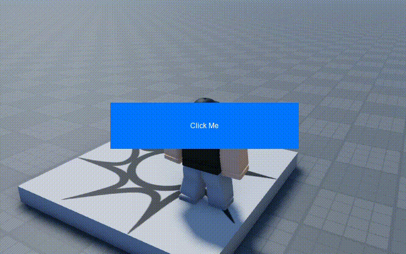

# Roblox Button Ripple Effect
A tutorial on creating the popular "ripple" effect that is shown when a button is clicked/pressed. Before continuing, you should have a basic understanding of scripting on Roblox and working with UI and Tweens.



## Creating the Button
Create and design the button however you wish, whether it's through a local script or manually adding it.
All that matters is that your button is properly showing up on the screen and there is a reference to it in a script. Set the `ClipsDescendants` property to true to prevent the ripple from being rendered outside button bounds.

*Sample Code*:

```Lua
--creating screen gui and parenting it to PlayerGui
local mainGUI = Instance.new("ScreenGui", script.Parent)

--creating a button that is centered in the middle of the screen
local button = Instance.new("TextButton")
button.AnchorPoint = Vector2.new(0.5, 0.5) --button is positioned by its center
button.Position = UDim2.fromScale(0.5, 0.5)
button.Size = UDim2.fromScale(0.2, 0.1)
button.BorderSizePixel = 0
button.BackgroundColor3 = Color3.new(0.0117647, 0.454902, 1)
button.Text = "Click Me"
button.TextColor3 = Color3.new(1, 1, 1)
button.ClipsDescendants = true --elements going outside button bounds will be cutoff
button.Parent = mainGUI
```

## Adding the Effect
Three variables are needed. Firstly, declare and initialize a variable for the `TweenService` which allows us to the tween/animate instances. Declare another variable that stores a `TweenInfo` object, which describes how the ripple will be tweened. The first argument is how long the tween will take in seconds, followed by the style. All the details on `TweenInfo` can be viewed [here](https://create.roblox.com/docs/reference/engine/datatypes/TweenInfo). The last variable describes what properties will be tweened, in this case it's size and image transparency—the ripple will grow and fade.

```Lua
local TweenService = game:GetService("TweenService")
local tweenInfo = TweenInfo.new(0.5, Enum.EasingStyle.Linear)
local tweenProperties = {Size = UDim2.fromScale(1, 1), ImageTransparency = 1}
```

Now, connect the following function to the button's `Activated` event. The `inputObject` makes it easier for us to create the ripple at specific positions in the button rather than just the middle.

```Lua
button.Activated:Connect(function(inputObject)
	--[[
		inputObject.Position gets the absolute position of where the button was activated.
		The ripple's position is relative to the button, so to properly display it, we must
		subtract the button's absolute position from inputObject's
	]]
	local ripple = Instance.new("ImageLabel")
	ripple.AnchorPoint = Vector2.new(0.5, 0.5)
	ripple.Position = UDim2.fromOffset(
		inputObject.Position.X - button.AbsolutePosition.X,
		inputObject.Position.Y - button.AbsolutePosition.Y)
	ripple.Size = UDim2.new(0, 0, 0, 0)
	ripple.SizeConstraint = Enum.SizeConstraint.RelativeXX --keeps the size proportional
	ripple.BackgroundTransparency = 1
	ripple.Image = "rbxassetid://5629962387" --i recommend using your own image
	ripple.Parent = button

	--tween the ripple's size and image transparency and delete it when done
	local tween = TweenService:Create(ripple, tweenInfo, tweenProperties)
	tween.Completed:Once(function()
		ripple:Destroy()
	end)
	tween:Play()
end)
```

You should now have a working ripple effect. If you wish to add this to multiple buttons, I recommend the [:AddTag](https://create.roblox.com/docs/reference/engine/classes/Instance#AddTag) method and/or "Properties" panel to tag said buttons, and then using the `CollectionService` to iterate over them.

*Sample Code*:

```Lua
local CollectionService = game:GetService("CollectionService")

for _, button in CollectionService:GetTagged("RippleButton") do
	button.Activated:Connect(function(inputObject)
		...
	end)
end
```

## Resources
- https://create.roblox.com/docs/reference/engine/classes/Tween
- https://create.roblox.com/docs/reference/engine/datatypes/TweenInfo
- https://create.roblox.com/docs/reference/engine/classes/InputObject
- https://create.roblox.com/docs/reference/engine/classes/CollectionService